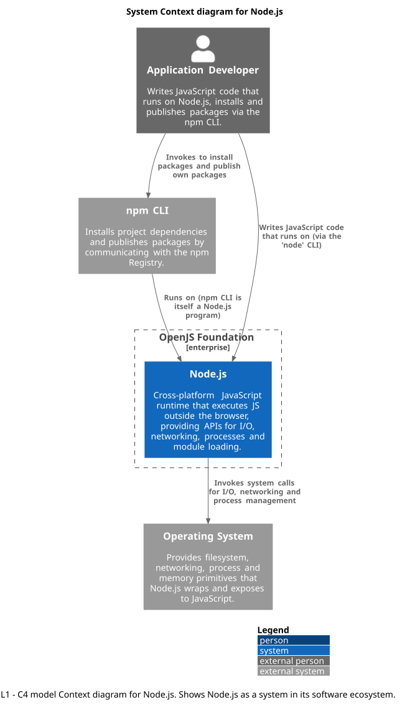
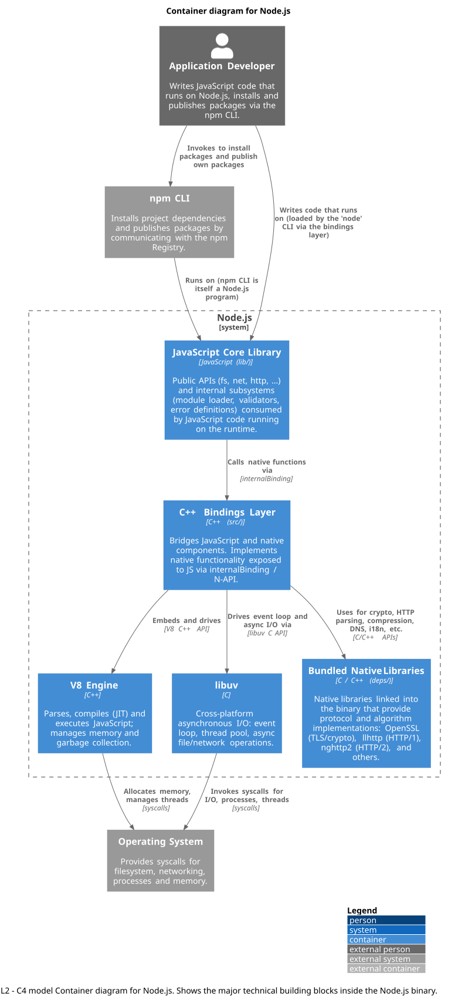
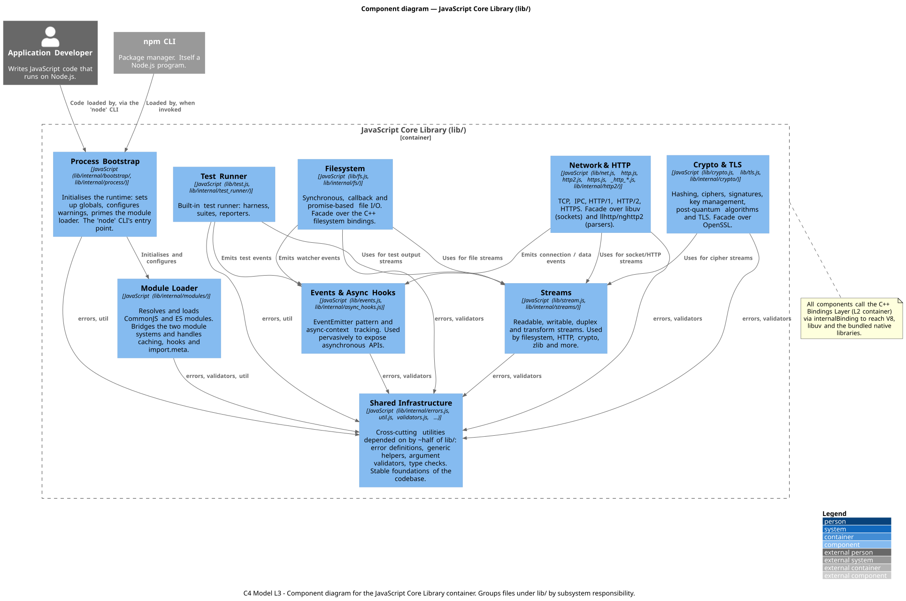

# Architecture Report
We model the architecture of Node.js using the C4 notation: Context (L1), Container (L2) and Component (L3). The L1 boundary contains Node.js as the system in scope, governed by the OpenJS Foundation. L2 opens that boundary to show the technical building blocks inside the binary, and L3 zooms into the JavaScript Core Library to show its subsystem components. A final section discusses architectural characteristics and style.

The diagrams were written in PlantUML using the C4-PlantUML notation.

## Level 1 - Context

_Source PlantUML: [`c4_level1_context.puml`](diagrams/c4_level1_context.puml)._

The Level 1 Context diagram places Node.js at the centre as the system in scope, governed by the OpenJS Foundation (shown as the enterprise boundary). Three external elements surround it.

The **Application Developer** writes JavaScript or TypeScript code that targets Node.js as its runtime, and uses the `npm` CLI to install dependencies or publish their own packages. The Developer is marked external because they do not belong to the OpenJS Foundation; they are users of the platform, not its maintainers. Node.js contributors are deliberately excluded, they build the runtime rather than use it, and belong in the Overview report's stakeholder list.

The **Operating System** is the only universal external dependency of Node.js. Every network connection, file read, process spawn or timer ultimately resolves into an OS system call. 

The **npm CLI** is a separate software system. Although the official Node.js installer bundles `npm`, the CLI is developed by npm Inc. (a GitHub / Microsoft subsidiary), has its own release cycle, can be replaced by alternatives (`yarn`, `pnpm`), and is itself a Node.js program. 

## Level 2 - Container

_Source PlantUML: [`c4_level2_container.puml`](diagrams/c4_level2_container.puml)._

The L2 Container diagram opens the Node.js system boundary to show its high-level technical building blocks, following the course definition of "container". The three external elements from L1 (Developer, npm CLI, Operating System) are carried over unchanged, preserving boundary consistency. Because Node.js ships as a single statically linked binary, the characteristic of being separately deployable does not apply to its internal containers; they are nonetheless distinct technologies with distinct responsibilities, and modelling them at this level makes the architecture visible.

- **JavaScript Core Library (`lib/`).** Written in JavaScript, it is the user facing surface of Node.js: public modules (`fs`, `net`, `http`, `crypto`, `streams`, `events`) and internal subsystems (module loader, validators, error definitions). The layer applications import via `require()`. It is composed around 111 kLOC across more than 360 JavaScript files.
- **C++ Bindings Layer (`src/`).** Written in C++, it bridges JavaScript and native code: every JS call that needs to touch the OS, parse HTTP, compute a hash, or allocate memory crosses through this layer via `internalBinding(...)` (internal) and N-API (public/stable).
- **V8 Engine.** It is Google's JavaScript engine. It parses, compiles (JIT) and executes JavaScript. It also manages the heap and garbage collector.
- **libuv.** It is a cross-platform asynchronous I/O library: event loop, thread pool, and abstractions for async file, network, child-process, and timer operations. It was originally written for Node.js: the event-loop architecture of Node.js is essentially the event-loop architecture of libuv.
- **Bundled Native Libraries.** It is a grouped container covering OpenSSL (TLS/crypto), llhttp (HTTP/1), nghttp2 (HTTP/2), c-ares (async DNS), zlib + brotli (compression), ICU (i18n), ada (URL parsing), simdjson/simdutf, undici, nghttp3/ngtcp2 (HTTP/3 + QUIC), uvwasi, the bundled SQLite, and others. We decided to group it because from the C++ Bindings Layer's perspective they play the same role: C/C++ libraries linked into the binary that provide specialised implementations.

Inside the boundary, the dependency chain runs strictly downward: the Core Library calls into the Bindings Layer via `internalBinding`, the Bindings Layer orchestrates V8, libuv, and the native libraries through their C/C++ APIs; only libuv and V8 talk to the OS. V8 and libuv do not communicate directly; both are driven by the Bindings Layer, which coordinates them as part of Node.js’s runtime model.

### Relationship to the Clean Architecture Blueprint
The container structure relates to the Clean Architecture blueprint in a non trivial way. Clean Architecture prescribes concentric layers with dependencies pointing inward toward stable abstractions. In Node.js:

- **Outermost ring (Frameworks & Drivers):** the JavaScript Core Library (`lib/`). The layer applications see and use.
- **Adapters:** the C++ Bindings Layer (`src/`). Translates between the JavaScript-facing API and the underlying native engines, playing the Interface Adapters role.
- **Innermost (Entities / Use Cases):** V8, libuv, and the bundled native libraries. Stable, low-level mechanisms with no awareness of the JavaScript layer above. They exist independently of Node.js (V8 is used by Chrome, libuv by other projects).

The **Dependency Rule** holds at compile time: `lib/` depends on `src/`; `src/` depends on V8, libuv, and the native libraries; the natives depend on none of the above. V8 does not import from `src/`, and `src/` does not import from `lib/`.

At runtime, control flow returns outward through callbacks, but this is not the same as a source code dependency violation. The compile time dependency direction remains mostly inward: `lib/` calls into `src/`, and `src/` coordinates V8, libuv and native libraries. However, when asynchronous operations complete, the C++ Bindings Layer invokes JavaScript callbacks supplied by `lib/` or by application code. This reversed runtime control flow is intrinsic to Node.js's asynchronous design: without it, the runtime could not notify JavaScript that an operation such as fs.readFile or a network request had completed.

The mapping is imperfect in scale: Clean Architecture's outer layer is normally a thin delivery mechanism, while Node.js's outer layer (`lib/`) is large and contains substantial logic of its own. So Node.js looks Clean Architecture shaped at the *boundaries* between layers, but the layers themselves are heavier than the blueprint envisions: a consequence of Node.js's nature as a runtime platform rather than a single application.

## Level 3 - Component

_Source PlantUML: [`c4_level3_component.puml`](diagrams/c4_level3_component.puml)._

L3 zooms into the JavaScript Core Library container and shows its subsystem-level components. The container groups its files by responsibility into nine components: Process Bootstrap, Module Loader, Shared Infrastructure (errors, util, validators, …), Streams, Events & Async Hooks, Filesystem, Network & HTTP, Crypto & TLS and Test Runner. We carry forward only the two external elements that interact with `lib/` directly: the Developer (via the `node` CLI) and the npm CLI (which is itself a Node.js program loaded by the Module Loader).

Two structural facts dominate the diagram. First, **every component depends on Shared Infrastructure**: the centralised error definitions, validators, and utilities. This matches the structural data we saw in the Software Design analysis: `internal/errors.js`, `internal/util.js` and `internal/validators.js` together are imported by over half of `lib/`. Second, the **cross-subsystem dependencies** that exist are concentrated in Streams and Events: Filesystem, Network, Crypto, and Test Runner all depend on Streams (for I/O pipelines) and Events (for asynchronous notification). The C++ Bindings Layer is reached uniformly by all components via `internalBinding`, shown as a note to avoid duplicating the same arrow nine times.

### SOLID Violations at the Component Level
The dependency analysis surfaced two SOLID violations visible at this level.

**Open/Closed Principle: Crypto & TLS component.** The Open/Closed Principle states that components should be open for extension but closed for modification. The Crypto & TLS component violates this: adding a new algorithm to the family (post-quantum, new symmetric cipher, etc.) requires modifying existing sibling algorithm files, not just adding a new one in isolation. The evidence is in the logical-coupling analysis: the algorithm files (`cfrg`, `ec`, `rsa`, `aes`, `mac`, `ml_dsa`, `ml_kem`, `chacha20_poly1305`) co-change at lift values of 60–130× chance despite having no direct imports between them. At the component level, this means the Crypto & TLS component's internal structure does not expose a clean extension point: implicit conventions (parameter validation, key-object shape, error handling) are replicated across siblings rather than encapsulated. The shared utility `crypto/util.js` centralizes some of this logic, but not enough to remove the hidden coupling. This is reflected in the logical coupling metrics: its dependents reach a maximum confidence of 0.407, while `crypto/keys.js` reaches 0.563, among the highest amplification ratios in `lib/`.

**Single Responsibility Principle: Module Loader component.** The SRP states that a module should have one, and only one, reason to change. `internal/modules/cjs/loader.js`, the central file of the Module Loader component, was modified in 69 of the 1,431 analysed commits (4.8%, the single most-changed file in `lib/`). High change frequency is not by itself a violation, but the *reasons* matter: the file is touched for CommonJS resolution, ESM/CJS interop, hooks, caching policy, error message formatting, and embedder-API changes. Its co-change pattern at L3 reflects this: `cjs/loader.js` co-changes heavily with `esm/translators.js`, `esm/loader.js`, and `esm/module_job.js` (the ESM interop axis) but also with `module_loader.helpers` (the resolution axis) and with `embedding.js` (the embedder API axis). These are distinct reasons to change concentrated in one file. The component as a whole could be split along these axes.

We deliberately do not list further violations on weak evidence. The Test Runner shows high co-change activity but mostly *consistent* coupling (Analysis 2 of the Design report): its imports and its co-change graph agree, so this is heavy development pressure rather than a SOLID violation. The remaining components show no clear signal.

## Architectural Characteristics
We have observed several architectural characteristics, supported by the coupling and cohesion data:

**Maintainability**, defined as *the degree of effectiveness and efficiency to which developers can modify the software to improve it, correct it, or adapt it to changes in environment and/or requirements*. 
- The Dependency Rule's compile-time satisfaction at L2 means changes to V8, libuv, or the native libraries do not propagate upward through Node.js's own code: an OpenSSL update is more likely to be absorbed by the native/bindings layer than to propagate directly into `lib/`.
- Within `lib/`, the Stable Dependencies Principle is satisfied: orchestrators have instability near 1.00 and foundations near 0.02–0.06, so dependency arrows flow from volatile to stable. The logical-coupling analysis confirms this stability is real, not merely structural: when `errors.js`, `util.js` or `validators.js` change, the average dependent has a probability below 2% of changing in the same commit. 
- The notable exception is the Crypto & TLS component, where the SOLID violation discussed above translates into reduced maintainability for that specific subsystem.

**Evolvability**, defined as *the system’s ability to survive changes in its environment, requirements and implementation technologies*. 
- Node.js maintains a multiyear backward compatibility commitment on its public API. The architecture supports this through the exceptionally high fan-in of `internal/errors.js` (198) and `internal/util.js` (159), combined with their near-zero instability: changing a foundational interface would force coordinated edits across hundreds of files and is therefore costly by design. 
- The Stable Dependencies Principle, expressed through the dependency structure, acts as a governance mechanism that discourages breaking changes. 
- The Bindings Layer's stable N-API plays the same role for native addons: it insulates third-party native code from changes in the underlying JavaScript engine, such as V8, allowing Node.js internals to evolve without breaking compatible addons.

**Performance**, defined as *the amount of time it takes for the system to process a business request*. The architecture supports high throughput through two complementary mechanisms. 
- First, V8’s JIT compiler optimizes hot JavaScript paths, allowing frequently executed code to run efficiently.
- Second, libuv's event-loop architecture allows a single thread to coordinate thousands of concurrent I/O-bound operations without blocking on each one, with a thread pool reserved for unavoidably blocking operations (filesystem, DNS, crypto). 
- The Bindings Layer threads these together so that an HTTP server can serve many connections by interleaving JS execution with libuv-driven I/O events. Heavy operations are delegated into native code in the Bundled Native Libraries (OpenSSL for crypto, nghttp2 for HTTP/2 framing, etc.), keeping the JavaScript layer free for orchestration.

**Extensibility**, defined as *the ease in which a system can be extended with additional features and functionality*. The C++ Bindings Layer exposes two relevant entry points: the private `internalBinding`, used internally by `lib/`, and the stable N-API, exposed as the architectural extension point for native addons.
- N-API is the architectural extension point for native addons: third-party C/C++ code can be loaded into the Node.js process and call into the runtime without depending on V8's or libuv's internal ABIs. This is what makes the npm ecosystem possible at the native level. 
- At the JavaScript level, the same role is played by the public modules in `lib/`, which application code can require freely without exposure to internal implementation details.

**Adaptability**, defined as *the ease in which a system can adapt to changes in environment and functionality*. libuv is an abstraction over POSIX and Win32 syscalls, providing a uniform asynchronous I/O API across operating systems. By isolating OS interaction in libuv (and V8 for memory and threads), the layers above are written once and run on Linux, macOS, Windows, BSD, AIX and others: the architecture adapts to its operating environment without recompilation of the JavaScript layer. The L2 diagram makes this explicit: only libuv and V8 talk to the OS, no other container does.

## Architectural Style
Node.js can be classified as a monolithic runtime with a layered internal architecture and an event-driven execution model.

From a deployment perspective, Node.js is monolithic. It is distributed and executed as a single runtime, and its main internal components are not deployed, scaled, or operated as independent services. Therefore, Node.js corresponds to a single architectural quantum: its components belong to the same deployable unit and do not form a distributed architecture made up of independently deployable parts.

Internally, Node.js follows a layered structure. As described in the lecture notes, layered architecture is based on technical partitioning: each layer has a specific technical responsibility, and dependencies usually flow from higher-level layers to lower-level layers. This idea fits Node.js well. High-level JavaScript APIs are mainly implemented in the `lib/` directory, while lower-level runtime functionality is implemented in the `src/` directory. From there, the native layer relies on components such as V8, libuv, OpenSSL, zlib, and other native libraries to handle JavaScript execution, asynchronous I/O, cryptography, compression, DNS, and networking.

In this structure, the JavaScript facing API layer is the interface used by developers. The native C++ layer connects those APIs with lower-level runtime functionality. Beneath that, V8 executes JavaScript code, while libuv provides the event loop and asynchronous I/O support. Other native dependencies provide more specialized functionality. In general, the dependency flow goes from JavaScript APIs to native bindings and then to the underlying execution and system libraries.

At runtime, Node.js is strongly event-driven. Its concurrency model is built around the event loop, coordinated mainly by libuv. Asynchronous operations such as file system access, timers, networking, and other I/O tasks are scheduled and later dispatched back to JavaScript when they complete. V8 then executes the corresponding callbacks, promise continuations, timers, and event handlers. For this reason, event-driven behavior is one of the central runtime characteristics of Node.js.

However, this event-driven nature should be understood primarily as an execution model, not as the main deployment architecture. Node.js itself is not a distributed event-driven architecture composed of independent services communicating through events. It is a single runtime whose internal concurrency and I/O model are event-driven.

Node.js should also not be classified as a modular monolith in the strict sense used in the lecture notes. Although it is modular in a general software engineering sense, its modules are mostly technical subsystems rather than domain based business capabilities. A modular monolith is usually partitioned around business areas such as customers, payments, orders, or inventory. Node.js does not follow that kind of domain partitioning. Its internal organization is closer to technical layering than to domain modularization.

Node.js also includes some microkernel-like extension mechanisms, especially through N-API for native addons and through its public JavaScript module system. These mechanisms allow additional functionality to be plugged into the runtime without directly modifying its core. Even so, this is only a secondary architectural trait.