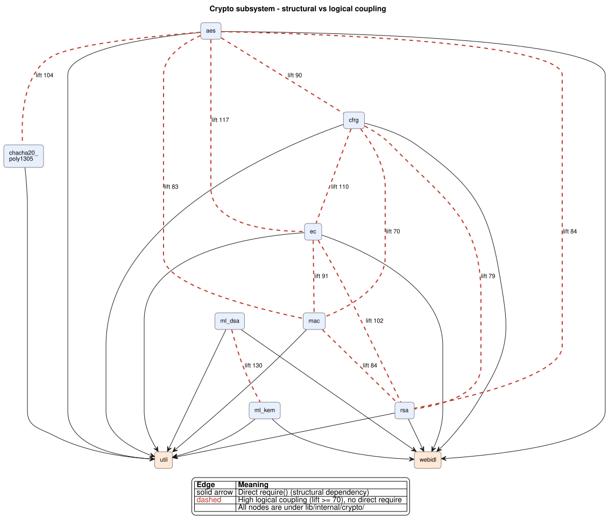

# Design Report

# Dependencies

## Methodology

We analyzed Node.js's core library (`lib/`, ~111 kLOC, 362 JavaScript files) along two complementary axes: **structural code dependencies** from `require()` statements, and **knowledge dependencies** from version-control co-change history. Structural analysis reveals the static design, while co-change analysis reveals how that design behaves under real development pressure.

**Code dependencies** were extracted with [`dependency-cruiser`](https://github.com/sverweij/dependency-cruiser) (`--no-config`) on the v25.9.0 snapshot. The tool parses the JavaScript AST, capturing the true static structure. It classifies each dependency as `coreModule: true` (native primitives like `buffer`, `path`, `events`, implemented in C++) or `coreModule: false` (internal JavaScript files). We made a custom script, `analyze-deps.js`, whic computes **fan-out**, internal **fan-in**, native fan-in and the SDP instability I = Fan-out / (Fan-in + Fan-out). Two caveats apply: without configuration, `dependency-cruiser` produces virtual placeholders for unresolved short paths like `require('internal/assert')`. Our script normalises these to their physical targets. Additionally, dynamic loading is invisible to static analysis: `lib/cluster.js` uses a template-literal `require()` whose target is computed at runtime.

**Knowledge dependencies** were computed via co-change mining of the Git history, following the standard logical-coupling methodology. We extracted the 1,439 commits touching `lib/` between January 2024 and v25.9.0 and computed three association-rule metrics per file pair: **support** (fraction of commits containing both files), **confidence(A -> B)** (conditional probability that B changed given A changed) and **lift** (support normalised by each file's individual change rate; > 1 indicates co-change above chance). We filtered out 8 commits touching more than 16 `lib/` files: a threshold at a natural gap in the commit-size distribution. A third script (`compare-deps.js`) cross-references the structural and logical graphs, distinguishing provider-consumer relationships (one utility serving many callers) from subsystem collaborators (files jointly implementing a single feature). 

All scripts and reproduction instructions are in the Annex.

---

## Code Dependency Results

### Files with Highest Fan-Out

| File                                    | Fan-out | Fan-in | I    |
| --------------------------------------- | ------- | ------ | ---- |
| `lib/internal/process/pre_execution.js` | 33      | 18     | 0.65 |
| `lib/internal/test_runner/runner.js`    | 29      | 2      | 0.94 |
| `lib/internal/http2/core.js`            | 28      | 1      | 0.97 |
| `lib/repl.js`                           | 26      | 0      | 1.00 |
| `lib/internal/fs/promises.js`           | 25      | 4      | 0.86 |

The top fan-out files are **orchestrators** wiring together independent subsystems. `pre_execution.js` runs at process startup and touches the module loader, DNS, cluster, and permissions. `repl.js` combines the loader, parser, readline, console and filesystem into an interactive shell.

The **Stable Dependencies Principle** (SDP) states that a module should depend only on modules at least as stable as itself, with stability measured by instability I = Fan-out / (Fan-in + Fan-out). These orchestrators correctly sit near maximum instability (I near 1.0), free to evolve without triggering side-effects because nothing depends on them. The outlier is `pre_execution.js` (I = 0.65), with substantial fan-in because other bootstrap and worker entry points reuse it: a dual role as orchestrator and shared utility.

### Files with Lowest Fan-Out

| File                                            | Fan-out | Fan-in | I    |
| ----------------------------------------------- | ------- | ------ | ---- |
| `lib/cluster.js`                                | 0\*     | 0      | -    |
| `lib/constants.js`                              | 0       | 0      | -    |
| `lib/internal/async_local_storage/run_scope.js` | 0       | 2      | 0.00 |
| `lib/internal/bootstrap/realm.js`               | 0       | 10     | 0.00 |
| `lib/internal/cluster/utils.js`                 | 0       | 3      | 0.00 |
| `lib/internal/constants.js`                     | 0       | 10     | 0.00 |

Genuine zero-fan-out files are **leaf nodes** by design: pure-value modules (`constants.js`), pre-bootstrap code that cannot yet use `require()` (`realm.js`), and small self-contained utilities. Several reach I = 0.00: maximally stable, introducing no transitive dependencies. The exception is `lib/cluster.js`, which records fan-out 0 due to a dynamic string-interpolation import evaluated at runtime, masking its true coupling from static analysis.

### Modules with Highest Fan-In

| Module                       | Fan-in | Fan-out | I    |
| ---------------------------- | ------ | ------- | ---- |
| `lib/internal/errors.js`     | 198    | 8       | 0.04 |
| `lib/internal/util.js`       | 159    | 10      | 0.06 |
| `lib/internal/validators.js` | 158    | 3       | 0.02 |
| `lib/internal/util/types.js` | 57     | 1       | 0.02 |
| `lib/internal/assert.js`     | 56     | 1       | 0.02 |

In this table we can see the highest fan-in modules (error definitions, utilities, validators, type checks, assertions), which are each depended on by roughly half of `lib/`. `lib/internal/errors.js` is required by 198 files yet maintains a low fan-out of 8, encapsulating heavy internal mechanics behind a simple interface and shielding nearly 200 consumers from that complexity. Their near-zero instability (I between 0.02 and 0.06) marks them as the stable foundations the SDP requires. 

Among native dependencies, `buffer` (65 dependents), `path` (50), `events` (34), `fs` (29) and `timers` (27) lead.

---

## Knowledge Dependency Results

The co-change analysis over 1.431 commits (after filtering) produced 1.835 distinct file pairs, of which 228 co-change at least three times. We report three findings.

### Finding 1. Provider-Consumer Relationships and Change Amplification

For each high-fan-in module M, we computed the average confidence C(M -> X) over all of M's structural dependents X: the probability that a randomly chosen dependent changes when M changes, controlling for M's own change frequency and its fan-in. These are **provider-consumer** relationships: one stable utility serving many unrelated callers. The ideal is average confidence close to 0: a well-designed utility absorbs internal changes without forcing its consumers to adapt.

| Module | Fan-in | Changes(M) | Avg C(M -> X) | Max C(M -> X) |
|---|---|---|---|---|
| `internal/errors.js` | 198 | 40 | 0.011 | 0.175 |
| `internal/util.js` | 159 | 33 | 0.010 | 0.121 |
| `internal/validators.js` | 158 | 7 | 0.016 | 0.143 |
| `internal/util/types.js` | 57 | 1 | 0.000 | 0.000 |
| `internal/util/inspect.js` | 39 | 28 | 0.005 | 0.036 |
| `internal/crypto/util.js` | 26 | 27 | **0.105** | **0.407** |
| `internal/crypto/keys.js` | 21 | 16 | **0.122** | **0.563** |
| `internal/modules/cjs/loader.js` | 19 | 69 | 0.064 | 0.304 |
| `internal/fs/utils.js` | 18 | 19 | 0.047 | 0.316 |

The general-purpose foundations (`errors`, `util`, `validators`, `util/types`, `util/inspect`) come close to the ideal with average confidence under 0.02. 

The clear outliers are `crypto/util.js` and `crypto/keys.js`, with average confidence 0.10-0.12 and max above 0.4: changes to these utilities frequently force coordinated edits in dependents. Despite serving fewer consumers than `errors.js`, their amplification is ten times higher: encapsulation quality matters more than fan-in size. `cjs/loader.js` and `fs/utils.js` show milder amplification, marking them as secondary review candidates.

### Finding 2. Information Leakage Among Siblings



_Source PlantUML: [`crypto_cluster_coupling.puml`](diagrams/crypto_cluster_coupling.puml)._

Pairs strongly coupled by lift but with no direct `require()` are candidates for information leakage: implicit coupling not visible in the import graph. Lift normalises joint change probability against independent probabilities: a lift of 1.0 indicates statistical independence. Filtering pairs with lift >= 2 and at least 3 co-changes produced 86 candidates. The top ones form a near-complete graph among the crypto algorithm implementations under `lib/internal/crypto/`.

| Pair                                      | Co-changes | Lift  |
| ----------------------------------------- | ---------- | ----- |
| `crypto/aes.js` <-> `crypto/ec.js`        | 9          | 117.1 |
| `crypto/cfrg.js` <-> `crypto/ec.js`       | 10         | 110.1 |
| `crypto/ec.js` <-> `crypto/rsa.js`        | 10         | 102.2 |
| `crypto/aes.js` <-> `crypto/cfrg.js`      | 9          | 90.1  |
| `crypto/aes.js` <-> `crypto/rsa.js`       | 9          | 83.6  |
| `crypto/cfrg.js` <-> `crypto/rsa.js`      | 10         | 78.6  |
| `crypto/ml_dsa.js` <-> `crypto/ml_kem.js` | 6          | 130.1 |

Lifts exceeding 100 mean these files co-change more than a hundred times more often than independence would predict; none imports another directly. The pattern extends to other crypto pairs (`hkdf <-> pbkdf2`, lift 286; `aes <-> chacha20_poly1305`, lift 104): the leakage is family-wide.

Inspecting the commits where `ml_dsa.js` and `ml_kem.js` changed together reveals two coexisting mechanisms. Some commits modified only the algorithm files, pure information leakage, where a convention (parameter validation, key shape, error handling) is replicated across siblings rather than encapsulated. Others also touched `crypto/util.js` or `crypto/webidl.js`, reflecting transitive coupling through shared utilities. The partial abstraction in `crypto/util.js` carries some shared concerns; residual conventions still leak across the family. The TLS and inspector subsystems show similar smaller-scale patterns (`_tls_common <-> _tls_wrap`, lift 238; `inspector/network_http <-> inspector/network_undici`, lift 127).

### Finding 3. Subsystem Collaborators and Development Hotspots

Finding 1 examined provider-consumer relationships where high co-change signals a leaky interface. Finding 3 examines **subsystem collaborators**: files that jointly implement a single feature, share a direct `require()` between them, and belong to the same subsystem (typically the same directory under `lib/internal/`). For these pairs, high co-change is expected and healthy: it means the files are genuinely co-evolved as a unit when the feature they share is developed.

We identified 131 such pairs (lift >= 2, co-changes >= 3), concentrated in three subsystems:

- **Module loader (CJS/ESM bridge):** `cjs/loader.js <-> esm/translators.js` (21 co-changes), `esm/loader.js <-> esm/translators.js` (18), `esm/loader.js <-> esm/module_job.js` (17). `cjs/loader.js` is the single most-changed file in the window (69 commits).
- **Test runner:** `harness <-> test` (17), `harness <-> runner` (14), `runner <-> test` (13). Heavy development activity consistent with a relatively recent built-in subsystem still maturing.
- **QUIC / HTTP/3:** `quic <-> symbols` (lift 119), `state <-> stats` (lift 358), `state <-> symbols` (lift 238). Very high lifts despite low absolute counts - QUIC files move in lockstep when they do change, a sign of a newly introduced subsystem still settling.

For these pairs the import graph and the change history agree: they are genuine collaborators. The distinction from Finding 1's outliers is that `crypto/util.js` and `crypto/keys.js` are utilities with many unrelated consumers: high amplification there means the interface is leaking. Here, co-changing files belong to the same subsystem and their co-change reflects intentional joint development.

---

# Patterns

We document six design pattern instances found in `lib/`, with locations, role mappings, problem/solution analyses and alternatives.

## Pattern 1 - Facade (Structural)

**Location.** Roots of public subsystems, e.g. `lib/dns.js` acting as the public entry point for the internal implementation files in `lib/internal/dns/`.

**Roles.**

| UML Role | Node.js Equivalent | Explanation |
|---|---|---|
| Facade | `lib/dns.js` | Unified, simple interface exposed to applications |
| Subsystem | `lib/internal/dns/promises.js`, `lib/internal/dns/utils.js` | Complex, specialised private modules executing the actual logic |

**Problem and Solution.** Subsystems like DNS or Crypto involve dense internal pipelines and volatile private utilities. Forcing client applications to interact with these internal modules directly would create severe change propagation. Facade solves this by exposing a clean, stable boundary at the root level (`lib/dns.js`). This public-to-private structure is a recurring Node.js convention: `lib/fs.js` facades `lib/internal/fs/`, `lib/crypto.js` facades `lib/internal/crypto/`, and so on.

**Alternative:** Direct Subsystem Exposure, clients import internal files directly. _Pro:_ fewer files, direct access to low-level features. _Con:_ breaks Information Hiding, tightly couples client code to implementation details, and undermines backward compatibility during refactors.

## Pattern 2 - Observer (Behavioral)

**Location.** `lib/events.js`: `EventEmitter` constructor at L209-211, observer storage in `EventEmitter.init` at L332-337, notification via `EventEmitter.prototype.emit` at L456, registration via `_addListener` and `EventEmitter.prototype.addListener` at L540 and L607.

**Roles.**

| UML Role        | Node.js Equivalent                                                        | Explanation                                                                  |
| --------------- | ------------------------------------------------------------------------- | ---------------------------------------------------------------------------- |
| Subject         | `EventEmitter` instance                                                   | Central object; holds a dictionary of events and listeners in `this._events` |
| Observer        | Listener callbacks registered to the subject                              | Plain functions; the Subject does not know their types                       |
| ConcreteSubject | Classes inheriting EventEmitter (HTTP servers, TCP sockets, file streams) | Emit real events during execution                                            |

**Problem and Solution.** In an event-driven platform like Node.js, asynchronous operations frequently complete and need to notify various parts of the application. If components directly referenced each other, coupling would be severe. EventEmitter solves this: any object can become an EventEmitter, parts of the code subscribe with `.on('event', callback)`, and `.emit('event')` notifies all subscribers without the Subject knowing their types or count.

**Alternative: Direct synchronous communication.** The core module explicitly knows about and calls every dependent module. _Pro:_ simpler to trace in small, linear, monolithic applications. _Con:_ tightly couples modules, violates Open/Closed (adding a feature that reacts to an event requires modifying the subject), and makes dynamic add/remove of listeners impractical.

## Pattern 3 - Strategy (Behavioral)

**Location.** `lib/crypto.js`: the `createHash` function at L144-146 and the import of the Hash abstraction at L109-113.

**Roles.**

| UML Role         | Node.js Equivalent                                            | Explanation                                                       |
| ---------------- | ------------------------------------------------------------- | ----------------------------------------------------------------- |
| Context          | `createHash` function and the Hash pipeline it returns        | Stable interface (`update()`, `digest()`) regardless of algorithm |
| Strategy         | The `algorithm` parameter of `createHash(algorithm, options)` | Behavioral switch selecting which algorithm runs                  |
| ConcreteStrategy | SHA-256, SHA-512, MD5, etc. via OpenSSL                       | Interchangeable algorithms the Context delegates to               |

**Problem and Solution.** Cryptographic hashing has an invariant workflow (init, update, finalize) but the algorithm differs. Without Strategy, the codebase would be littered with `if/else` or `switch` over every algorithm. By isolating the varying behavior in the `algorithm` parameter, `crypto.createHash('sha256')` picks one strategy and `'md5'` picks another while the rest of the code stays the same.

**Alternative: Hardcoded methods per algorithm**, `createSHA256Hash()`, `createMD5Hash()`. _Pro:_ explicit naming, slightly better autocomplete. _Con:_ tightly couples client code to specific algorithms and violates Open/Closed, every new OpenSSL algorithm requires a new exported function, bloating the API.

## Pattern 4 - Template Method (Behavioral)

**Location.** `lib/internal/streams/writable.js` and `readable.js`. The contract is documented at `writable.js` L23: "Implement an async `_write(chunk, encoding, cb)`, and it'll handle all the drain event emission and buffering." Base class calls `_write()` inside `writeOrBuffer` at L570 and `doWrite` at L596. The hook definition at L796-801 throws `ERR_METHOD_NOT_IMPLEMENTED` if not overridden. The same pattern appears in `readable.js`: `_read()` called at L742 and defined at L908-910.

**Roles.**

| UML Role           | Node.js Equivalent                                                         | Explanation                                       |
| ------------------ | -------------------------------------------------------------------------- | ------------------------------------------------- |
| AbstractClass      | `Writable` / `Readable`                                                    | Defines the fixed pipeline skeleton               |
| TemplateMethod     | `write() -> writeOrBuffer() -> doWrite() -> _write()`; `read() -> _read()` | Pipeline the base class controls                  |
| PrimitiveOperation | `Writable.prototype._write` (L796), `Readable.prototype._read` (L908)      | Single step left empty for subclasses             |
| ConcreteClass      | `fs.WriteStream`, `net.Socket`, etc.                                       | Extends Writable/Readable and implements the hook |

**Problem and Solution.** Every custom stream needs the same complex pipeline logic: buffering, backpressure, drain events, error handling, encoding. Without Template Method, each developer would re-implement all of it, likely incorrectly. The base class centralises the stable algorithm and calls `_write()`/`_read()` at the right moment; the subclass fills in only that step. The Hollywood Principle: don't call us, we'll call you. A subclass that does not override the primitive receives `ERR_METHOD_NOT_IMPLEMENTED` at runtime, enforcing the contract.

**Alternative: Strategy via constructor option**, `new Writable({ write(chunk, encoding, cb) {...} })`. Node.js supports this directly at `writable.js` L409: `this._write = options.write`. _Pro:_ no inheritance, inline behavior. _Con:_ the base class cannot enforce that the hook was provided before the stream is used, errors appear later at runtime rather than at definition time, and the enforced algorithm skeleton is lost.

_Template Method vs Decorator._ Both patterns appear in the stream module but differ in mechanism: Template Method uses inheritance so a subclass fills in one step; Decorator uses composition to wrap one stream around another.

## Pattern 5 - Singleton (Creational)

**Location.** `lib/internal/modules/cjs/loader.js`: the registry `Module._cache = { __proto__: null }` at L351, fast-path cache check in `Module._load()` at L1238 and L1245-1258, the main cache check at L1285-1308, and the first-load write `Module._cache[filename] = module` at L1338.

**Roles.**

| UML Role      | Node.js Equivalent                          | Explanation                                                                        |
| ------------- | ------------------------------------------- | ---------------------------------------------------------------------------------- |
| Singleton     | The module object stored in `Module._cache` | Created once, reused; the single shared instance                                   |
| Instance      | `Module._cache[filename].exports`           | Cached exports returned to all callers                                             |
| getInstance() | `require()` / `Module._load()`              | Checks the cache and returns the instance; only executes module code on first call |

**Problem and Solution.** Modules like `http` or a database connection pool require exactly one shared instance. Without caching, ten `require('http')` calls would execute the module ten times, producing ten objects with separate state, event listeners on one would not fire on another. The CommonJS module system enforces the Singleton guarantee automatically: the first `require()` executes the module and stores it at L1338, every subsequent call returns the cached exports without re-executing. The caller never needs to know whether the instance is fresh or cached.

**Alternative: Dependency Injection**, pass the instance explicitly: `function processData(db) {...}`. _Pro:_ improved testability, explicit dependencies. _Con:_ boilerplate across every consumer; for truly global resources like `process` or an EventEmitter bus, passing the instance everywhere is impractical.

## Pattern 6 - Decorator (Structural)

**Location.** `lib/internal/streams/transform.js`: `Transform` class builds on top of `Duplex` by linking their prototypes (L77-78) and calling the parent constructor at L102; the abstract `_transform()` hook is at L162, and `_write()` at L166 routes incoming data through `_transform()`. `lib/zlib.js`: `ZlibBase` calls `Transform.call(this, ...)` at L257 and sets up the prototype chain at L276-277; concrete classes Gzip (L740), Deflate (L722), Gunzip (L749) extend this chain. Full hierarchy: `Gzip -> Zlib -> ZlibBase -> Transform -> Duplex`.

**Roles.**

| UML Role          | Node.js Equivalent                       | Explanation                                                                                      |
| ----------------- | ---------------------------------------- | ------------------------------------------------------------------------------------------------ |
| Component         | `Duplex` (`read()`, `write()`, `pipe()`) | The shared interface all streams follow                                                          |
| ConcreteComponent | A basic Duplex stream, e.g. `net.Socket` | Provides the original stream behaviour with no extras                                            |
| Decorator         | `Transform` in `transform.js`            | Extends Duplex stream and adds the `_transform()` hook while forwarding normal stream operations |
| ConcreteDecorator | `Gzip`, `Deflate`, `Gunzip` in `zlib.js` | Override `_transform()` to handle compression or decompression                                   |

**Problem and Solution.** Streams often need extra processing layered on: compression, decompression, encryption, all dynamically. Inheritance alone would create a subclass explosion: `GzipReadable`, `EncryptedWritable`, `GzipEncryptedDuplex`. Decorator solves this by letting `Transform` extend an existing stream and add new behavior through `_transform()`. Specific decorators override this method, and because each still behaves like a normal stream they chain naturally with `.pipe()`: `source.pipe(gzip).pipe(encrypt).pipe(dest)`.

**Alternative: Strategy.** Inject a transformation function into a generic processing stream. _Pro:_ simpler design, fewer classes and less inheritance. _Con:_ loses `.pipe()` chaining and the programmer must handle buffering and coordination manually.

---

# Summary

The dependency structure of `lib/` follows the Stable Dependencies Principle: orchestrators like `pre_execution.js` and `repl.js` have high instability and are free to change, while foundational utilities (`errors.js`, `util.js`, `validators.js`) have very high fan-in and near-zero instability. Co-change analysis confirms that most foundations are genuinely stable : their average per-dependent confidence sits below 0.02, meaning internal changes almost never force consumers to adapt. The principal exception is the crypto subsystem: its shared utilities (`crypto/util.js`, `crypto/keys.js`) propagate changes to dependents an order of magnitude more often, and its sibling algorithm files co-change at lift values of 60-130x despite having no direct imports, implicit conventions replicated rather than encapsulated. Subsystem collaborators (module loader, test runner, QUIC) show high co-change alongside structural imports, confirming that their coupling reflects intentional joint development rather than design leakage.

The pattern analysis explains how Node.js manages complexity at scale. The Facade pattern (e.g. dns.js) provides stable public boundaries over volatile internals. Observer underpins the event-driven architecture through EventEmitter. Template Method centralises common stream behaviour in a base class, helping explain why the streams subsystem's high fan-in does not translate into co-change amplification. Strategy makes crypto.createHash extensible without conditionals, and the CommonJS module cache provides transparent Singleton behaviour.

---
# Annex: Reproducibility Guide

The analysis scripts are located in the `scripts/` directory of the repository. All commands below must be run from the root of a local clone of the Node.js repository.

| Script | Purpose |
|---|---|
| `scripts/analyze-deps.js` | Computes fan-out, fan-in, and SDP instability from the dependency-cruiser JSON |
| `scripts/knowledge-deps.js` | Mines git co-change history; computes support, confidence, and lift per file pair |
| `scripts/compare-deps.js` | Cross-references structural and logical graphs to identify information leakage, consistent coupling, and per-module amplification |

## Reproducing the structural dependency analysis

```bash
# 1. Checkout the analysed snapshot
git checkout v25.9.0

# 2. Generate the dependency graph (requires dependency-cruiser)
npx dependency-cruiser --no-config lib/ --output-type json > structural-dependencies.json

# 3. Compute fan-out, fan-in and instability
node scripts/analyze-deps.js
```

## Reproducing the knowledge dependency analysis

```bash
# 4. Mine git co-change history and compute association-rule metrics
#    Writes knowledge-deps-data.json, must be run before step 5
node scripts/knowledge-deps.js

# 5. Cross-reference structural and logical graphs
node scripts/compare-deps.js structural-dependencies.json knowledge-deps-data.json
```

The defaults (`--since 2024-01-01 --ref v25.9.0 --max-files 16`) reproduce the exact analysis in the report; no additional flags are required.
